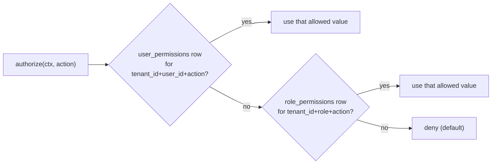
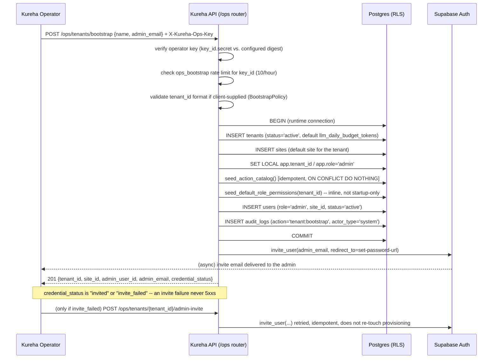

# Tenant Admin Registration & Default Provisioning

Design document for how a new tenant's **first user (the admin)** should be provisioned, and what default records/permissions a tenant needs before it's usable. Most of what this document describes is now shipped (see [Current implementation status](#current-implementation-status) for exactly what's real vs. still proposed) — the sections below still read as a design rationale, since that reasoning is what the implementation follows and what any future change (e.g. public self-service) should keep respecting.

Related reading: `docs/supabase-setup.md` (how the IdP is provisioned), `openspec/changes/kureha-mvp/design.md` §17 (ADR-14/15, auth architecture), `backend/AGENTS.md` (RLS/RBAC conventions), `openspec/config.yaml` (regulatory constraints this design must satisfy: Ley 29733, RENHICE/HL7 FHIR PE-CORE, Reglamento Ley 31814, SUSALUD).

## Current implementation status

| Piece | Status | Where |
|---|---|---|
| Tenant creation (`tenants` row) | ✅ Implemented | `POST /ops/tenants/bootstrap`, `backend/app/platform/inbound/api/routers/ops_tenants.py`; UI at `frontend/src/app/ops/bootstrap-tenant/page.tsx` |
| First-admin bootstrap | ✅ Implemented, operator-gated (see [Trust boundary](#trust-boundary)) | same as above, plus `POST /ops/tenants/{tenant_id}/admin-invite` for retrying a failed invite |
| Staff invite (by an *existing* admin) | ✅ Implemented | `POST /staff/register`, `backend/app/platform/inbound/api/routers/staff.py` |
| RBAC action catalog seed | ✅ Implemented, runs on every app startup | `seed_action_catalog`, `backend/app/modules/governance/rbac/adapters/outbound/rbac/action_catalog.py` |
| Default role→permission grants | ⚠️ Implemented but explicitly flagged **dev-only, not business-approved**, and only seeded for tenants that already exist at process startup | `DEFAULT_DEV_ROLE_PERMISSIONS`, `backend/app/modules/governance/rbac/adapters/outbound/rbac/default_role_permissions.py` |
| RLS isolation (16 tables) | ✅ Implemented | migration `613f9ea3526f` |
| Append-only, hash-chained audit log | ✅ Implemented | migration `776b456050fe` |
| Patient self-registration | ❌ Explicit `NotImplementedError` | `PostgresUserDirectory.provision_patient_user`, `backend/app/modules/identity/adapters/outbound/postgres/user_directory.py:74-80` |

### The chicken-and-egg problem (solved)

`POST /staff/register` (`staff.py:33-65`) is how new staff — including a second admin — get an account. But it requires an already-authenticated actor holding the `staff:register` permission (`_require_authorized` → `AuthorizeAction`, line 30). For a brand-new tenant, no such actor exists yet, so that endpoint can't create a tenant's *first* user.

This is closed by a separate, operator-gated endpoint — `POST /ops/tenants/bootstrap` — that doesn't require any tenant-scoped actor at all; it trusts a Kureha-operator credential instead (see [Trust boundary](#trust-boundary)). Before this existed, the only way a tenant + its first user got created was a direct SQL insert, mirrored from test fixtures (`backend/tests/schema/helpers.py::make_tenant()`, `backend/tests/platform/inbound/api/routers/conftest.py::_make_tenant_with_rbac()`) — no password, no invite email, no audit trail. That workaround is no longer necessary outside of tests.

### A second gap this design must close: startup-only RBAC seeding

`bootstrap_rbac_catalog_and_grants` (`backend/app/composition_root.py:201-208`) runs once, in `app/main.py`'s `_lifespan` (line 72), at process startup. It loops over every row currently in `tenants` and seeds `role_permissions` for each. **A tenant created while the app is already running gets zero role permissions until the next deploy/restart** — every request from that tenant's users would be denied by `PermissionPolicy.resolve` (deny-by-default, `governance/rbac/domain/permission.py:7-16`). Any tenant-creation flow **must** call `seed_default_role_permissions(conn, tenant_id)` synchronously as part of tenant creation — it cannot rely on the startup hook.

## Data model

```mermaid
erDiagram
    tenants ||--o{ sites : "has"
    tenants ||--o{ users : "scopes"
    tenants ||--o{ role_permissions : "scopes"
    tenants ||--o{ action_permissions : "references (global)"
    sites ||--o{ users : "assigns"
    users ||--o{ user_permissions : "overrides"

    tenants {
        uuid id PK
        text name
        text status "active | suspended"
        int llm_daily_budget_tokens "default 100000"
    }
    sites {
        uuid id PK
        uuid tenant_id FK
        text name
    }
    users {
        uuid id PK
        uuid tenant_id FK
        uuid site_id FK "NOT NULL, even for admin"
        text role "patient|reception|professional|admin"
        text status "active|inactive"
        uuid patient_id FK "required if role=patient"
        uuid professional_id FK "required if role=professional"
    }
    action_permissions {
        text key PK "e.g. staff:register"
        text description
        bool requires_hitl
    }
    role_permissions {
        uuid tenant_id PK_FK
        text role PK
        text action PK_FK
        bool allowed
    }
    user_permissions {
        uuid tenant_id PK_FK
        uuid user_id PK_FK
        text action PK_FK
        bool allowed "per-user override"
    }
```

Key constraint that shapes the bootstrap flow: `users.site_id` is `NOT NULL` for every role, including `admin` (migration `8fc0dc6f958d`). **A tenant cannot have an admin without at least one site existing first.**

## Roles and permissions

Four roles, fixed by a DB `CHECK` constraint on `users.role`: `patient`, `reception`, `professional`, `admin`.

Two independent authorization layers apply to every request (`backend/AGENTS.md`):

- **RLS** (Postgres row-level security) — narrows *which rows exist* for the current session, driven by `SET LOCAL` GUCs (`app.tenant_id`, `app.site_id`, `app.role`, `app.user_id`, ...).
- **RBAC** (`role_permissions` / `user_permissions`) — narrows *which actions* a role may perform, resolved by `PermissionPolicy.resolve`: **user override wins → else role grant → else deny.**



### Default action catalog (`ACTION_CATALOG`)

| Action key | Description |
|---|---|
| `appointment:create` | Schedule a new appointment |
| `appointment:reschedule` | Move an appointment to a different slot |
| `appointment:cancel` | Cancel an appointment |
| `appointment:view` | View appointment/reminder data |
| `session:revoke_all` | Admin-revoke every active session for a user |
| `staff:register` | Register a new staff member |
| `staff:deactivate` | Deactivate a staff member |
| `shift:create` | Create a shift for a staff member |
| `shift:edit` | Edit an existing shift |
| `calendar:connect` | Connect a patient's Google Calendar via OAuth2 |

### Default role → action grants (`DEFAULT_DEV_ROLE_PERMISSIONS`)

> ⚠️ The source module docstring calls this **"NOT BUSINESS-APPROVED — loosest defensible assignment per role, covering every action in the catalog a role would plausibly need in ANY clinic."** Treat the table below as a dev placeholder pending sign-off, not a compliance-reviewed permission matrix (`openspec/config.yaml`'s SUSALUD/Ley 31814 traceability requirements likely demand a reviewed matrix before production use).

| Action | patient | professional | reception | admin |
|---|:---:|:---:|:---:|:---:|
| `appointment:view` | ✅ | ✅ | ✅ | ✅ |
| `appointment:reschedule` | | ✅ | ✅ | ✅ |
| `appointment:create` | | | ✅ | ✅ |
| `appointment:cancel` | | | ✅ | ✅ |
| `shift:create` | | | ✅ | ✅ |
| `shift:edit` | | | ✅ | ✅ |
| `staff:register` | | | ✅ | ✅ |
| `staff:deactivate` | | | ✅ | ✅ |
| `session:revoke_all` | | | | ✅ |
| `calendar:connect` | ✅ | | | |

Note `reception` and `admin` are identical except `session:revoke_all` — the only action reserved exclusively for `admin` today.

## Row-level security (multi-tenant isolation)

Migration `613f9ea3526f` enables `ROW LEVEL SECURITY` + `FORCE ROW LEVEL SECURITY` (deny-by-default, applies even to the table owner) on every operational table. Two Postgres roles exist: `app_user` (bootstrap/migrations, `BYPASSRLS`) and `app_runtime` (used for actual request traffic — policies only bind here). `tenants`, `action_permissions`, and `rate_counters` are intentionally **not** RLS-scoped (global/reference data).

Relevant policies on `users`:

```sql
-- Any user can see their own row
CREATE POLICY users_self_select ON users FOR SELECT
  USING (app.tenant_id = tenant_id AND app.user_id = id);

-- reception/admin see the whole site directory
CREATE POLICY users_staff_select ON users FOR SELECT
  USING (app.tenant_id = tenant_id AND app.site_id = site_id
         AND app.role IN ('reception', 'admin'));

-- only admin can write (insert/update/delete) user rows
CREATE POLICY users_admin_write ON users FOR ALL
  USING (app.tenant_id = tenant_id AND app.site_id = site_id
         AND app.role = 'admin');
```

Isolation is enforced entirely at the database layer via session-scoped `SET LOCAL` variables set per request — **never** by filtering `WHERE tenant_id = ...` in application code. This matters for the bootstrap flow: whatever creates the first admin row must either run as `app_user` (RLS-bypassing, migration-style) or set `app.role = 'admin'` for that transaction before the `users_admin_write` policy will allow the insert — same pattern `bootstrap_rbac_catalog_and_grants` already uses (`composition_root.py:206-207`).

## Audit trail

`audit_logs` (migration `776b456050fe`) is append-only (`BEFORE UPDATE/DELETE/TRUNCATE` triggers raise unconditionally) and hash-chained per tenant (`prev_hash`/`row_hash`, SHA-256, serialized with `pg_advisory_xact_lock`). RLS on it: any actor can `INSERT` rows for their own tenant; only `admin` can `SELECT` the full tenant trail (`audit_logs_admin_select`); everyone can `SELECT` their own entries (`audit_logs_actor_select`).

Every step of tenant/admin bootstrap must write an `audit_logs` entry — `actor_type = 'system'` for the automated steps, `actor_id` set once the admin's `user_id` exists. This is not optional: SUSALUD/Ley 31814 (`openspec/config.yaml`) require every automated decision to be traceable, and provisioning the entity that will hold `admin` privileges over patient data is exactly the kind of event that must be auditable.

## Bootstrap flow

### Trust boundary

The core problem is authorization: `POST /staff/register` gates on an existing actor's `staff:register` permission, but tenant bootstrap has no actor yet. This needs a **different** trust boundary — not a relaxation of RBAC for regular users. Two approaches were considered:

1. **Operator-issued signed bootstrap token.** Kureha ops (not the tenant) generates a single-use, time-limited token out-of-band (e.g. during sales onboarding) tied to a tenant name/plan. The prospective admin redeems it once via a dedicated, unauthenticated-but-token-gated endpoint. This keeps the "no unauthenticated write path creates privileged rows" invariant intact — the token *is* the authorization, scoped to exactly one tenant-creation. **Not implemented** — this remains the path to take if/when tenant bootstrap needs to become public self-service; it is not a drop-in change (needs token issuance, storage, and redemption tracking) and shouldn't be assumed to exist.
2. **Internal ops-only endpoint**, authenticated with a separate Kureha-staff credential (not a tenant `admin`), for a human on the Kureha side to run tenant onboarding directly. Simpler to build first; less self-service. **This is what's implemented** — `POST /ops/tenants/bootstrap` and `POST /ops/tenants/{tenant_id}/admin-invite`, gated by a static, pre-shared operator credential (`X-Kureha-Ops-Key: <key_id>.<secret>`, verified by `StaticOperatorCredentialVerifier` — `backend/app/platform/inbound/api/access_control/adapters/static_operator_credential_verifier.py` — against `settings.ops_bootstrap_credentials`, `key_id:sha256_hex` pairs). There is no per-tenant token: the operator credential itself is the authorization for any number of bootstraps, subject to a 10/hour rate limit per `key_id`. An internal-only frontend form at `frontend/src/app/ops/bootstrap-tenant/page.tsx` wraps this endpoint — it is deliberately unlisted (no nav link from tenant-facing UI) and asks the operator for their key on every use rather than persisting it.

Either way, there is **not** a public, fully unauthenticated "create tenant + become admin" endpoint — that would be an open door for tenant-squatting and abuse with no rate-limiting story. The router only registers when `settings.ops_bootstrap_enabled` is true (kill switch), and `/ops` is exempt from `AccessControlMiddleware` since the router authenticates itself and opens its own DB connections.

### Sequence (as implemented — static operator credential)



Everything up to and including the `users` insert happens in **one transaction** — a partially-created tenant (e.g. `tenants` row with no admin) is worse than no tenant at all, since it'd be invisible to the tenant list but silently unusable. The Supabase invite call happens *after* commit, on a separate elevated connection — a deliberate departure from `ProvisionStaffIdentity`'s existing pattern (`backend/app/modules/identity/application/use_cases/provision_staff_identity.py:40-42`): that use case calls `invite_user` *before* the DB insert (IdP-first), which bootstrap does not copy — DB-first is safer here because a failed invite still leaves a retryable tenant/admin (via the admin-invite endpoint above) instead of an orphaned Supabase invite with no corresponding user row.

**`tenant_id` generation:** `tenants.id` has a `DEFAULT gen_random_uuid()` (migration `8fc0dc6f958d`). When the request omits `tenant_id`, `PostgresTenantProvisioningRepository` inserts without an explicit id and lets the database generate it (`INSERT INTO tenants (name) VALUES (...) RETURNING id`) — the id is never generated in application code (`IdGeneratorPort` remains scoped to `site_id`/`admin_user_id` only). A caller **can** still supply `tenant_id` explicitly for idempotent retries (a client-generated UUID makes a retry-after-timeout hit the `tenants` PK conflict and translate to `TenantAlreadyExistsError`/409 instead of creating a duplicate), but the human-facing ops form at `frontend/src/app/ops/bootstrap-tenant/page.tsx` no longer exposes that field — asking an operator to hand-type a UUID for retry safety isn't something a human can reliably do, so the form always lets the database generate it and the idempotency-key path stays available only to programmatic callers of the API.

### Default records created per tenant

| Record | Source | Notes |
|---|---|---|
| `tenants` row | new | `status='active'`, `llm_daily_budget_tokens` defaults to `100000` (DB default, migration `7441c553c450`) |
| `sites` row (≥1 default site) | new | required because `users.site_id` is `NOT NULL` even for `admin` |
| `users` row for the admin | new | `role='admin'`, `status='active'`, no `patient_id`/`professional_id` needed |
| `action_permissions` catalog | idempotent upsert | global, shared across tenants — safe to re-run |
| `role_permissions` for this tenant | **must run inline**, not wait for next startup | seeds `DEFAULT_DEV_ROLE_PERMISSIONS` for all 4 roles |
| `audit_logs` entry | new | `action='tenant:bootstrap'`, ties the whole operation to one traceable record |
| Supabase auth identity | via `AuthPort.invite_user` | credential mechanics only — never clinical data (see `docs/supabase-setup.md`) |

Not proposed as part of default bootstrap (explicitly out of scope unless a future requirement says otherwise): `consent_policies` rows (tenant-specific legal content, not something the platform can default sanely) and any patient/professional seed data.

## Security checklist for implementation

- [x] Tenant-creation endpoint must **not** be reachable without the bootstrap token (or ops credential) — no path where an anonymous request creates a privileged `admin` row. *(operator credential, `_require_operator` on the `/ops` router)*
- [ ] ~~Bootstrap token: single-use, short TTL, tenant-scoped, invalidated on redemption or expiry~~ — N/A for the implemented variant (static operator credential, not a per-tenant token); applies only if/when the token-redemption variant above gets built.
- [x] `seed_default_role_permissions` called **inline** during tenant creation (closes the startup-only gap above), not deferred to the next deploy.
- [x] Tenant + site + admin-user insert wrapped in one transaction; no visible tenant without a usable admin.
- [x] RLS still applies to the bootstrap transaction — either run as `app_user` (RLS-bypass, like migrations) or explicitly `SET LOCAL app.role = 'admin'` before the `users` insert, matching `bootstrap_rbac_catalog_and_grants`'s existing pattern.
- [x] Every step writes to `audit_logs` — tenant creation is exactly the kind of event Ley 31814/SUSALUD traceability requirements care about. *(`AuditAction.TENANT_BOOTSTRAP`; operator-credential denials also audited via `AuditAction.OPS_CREDENTIAL_DENIED`)*
- [x] Rate-limit/monitor the bootstrap endpoint independent of per-tenant `rate_counters` (a not-yet-a-tenant request has no `tenant_id` to scope by). *(`ops_bootstrap` dimension, 10/hour per operator `key_id`; rate-limit *denials* are not separately audited — an accepted, documented scope gap, not a bug)*
- [x] Client-supplied `tenant_id` is validated as a well-formed UUID (`BootstrapPolicy.validate_tenant_id`) before it reaches any SQL — closes a SQL-injection surface found in post-implementation review.
- [ ] Before production use, get explicit business sign-off on `DEFAULT_DEV_ROLE_PERMISSIONS` — it is currently a placeholder, not a reviewed matrix, and Ley 29733's sensitivity requirements around health data make an unreviewed default risky for the `admin`/`reception` grant especially. **Still open.**
- [ ] Decide whether a second admin can self-promote or must always go through another admin's `staff:register` — not addressed by this flow. **Still open.**

## Open questions

- If the token-redemption variant is ever built for public self-service, who holds the credential that issues bootstrap tokens — a separate internal tool, or a role inside this same API? (Today's static operator credential is just `settings.ops_bootstrap_credentials`, config-managed — no issuance flow exists because there's no per-tenant token to issue.)
- Does `llm_daily_budget_tokens`'s default (`100000`) need to vary by plan at bootstrap time, or is a follow-up admin action sufficient?
- Should the default site be named generically (e.g. tenant name) or require the admin to name it during bootstrap?
